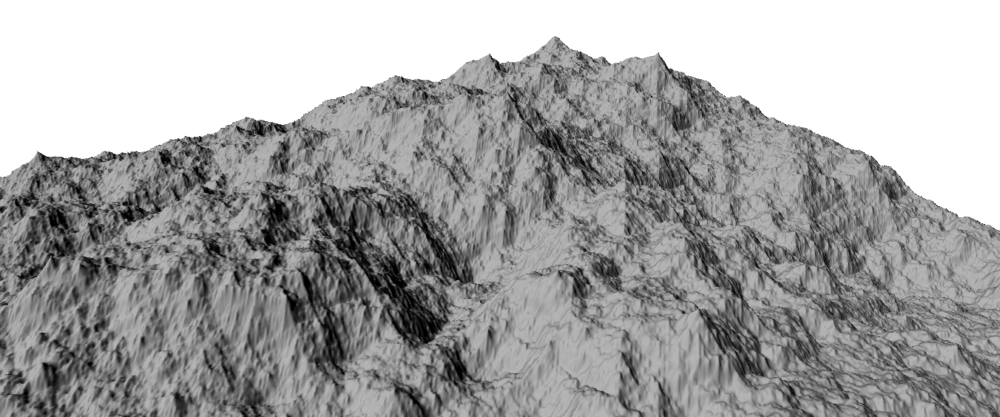
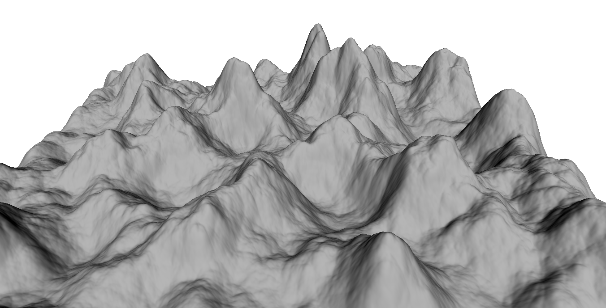
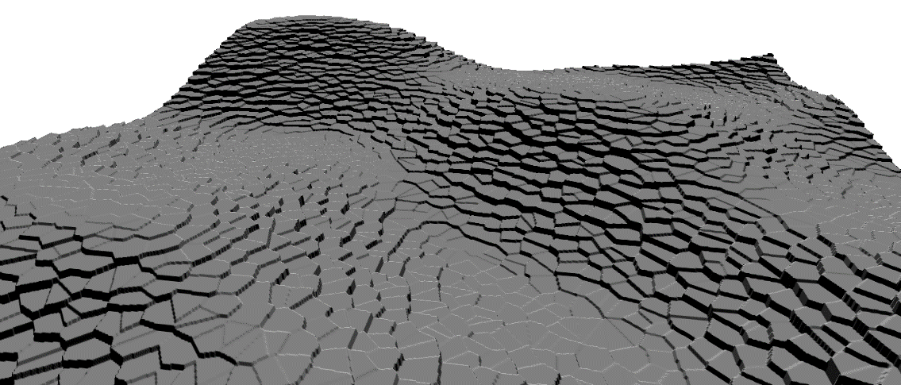
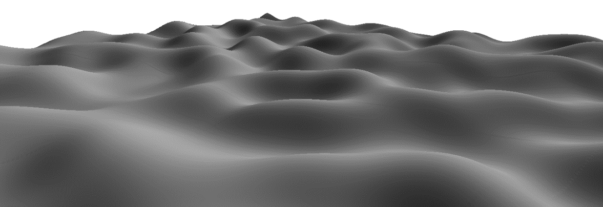
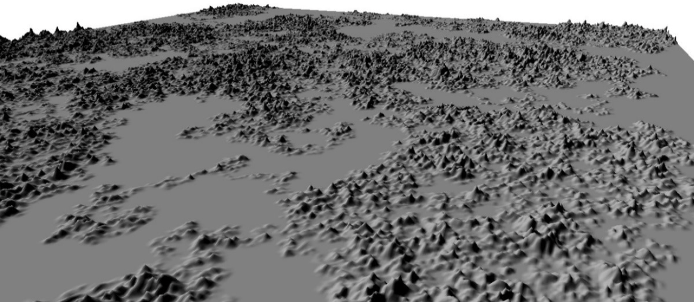

# Polygonal Terrain Generator

Polygonal terrain generator allows to create a **terrain** and **heightmap** using any of the following algorithms:

1. Random
2. Random walk
3. Drunkard walk
4. Rectangle
5. Hills
6. Perlin noise
7. Simplex noise
8. Diamond square
9. Voronoi

---

#### Terrain output examples using some selected algorithms: 

_Diamond Square_  

_Hill_  

_Voronoi_  

_Simplex noise_  

_Random walk_  
